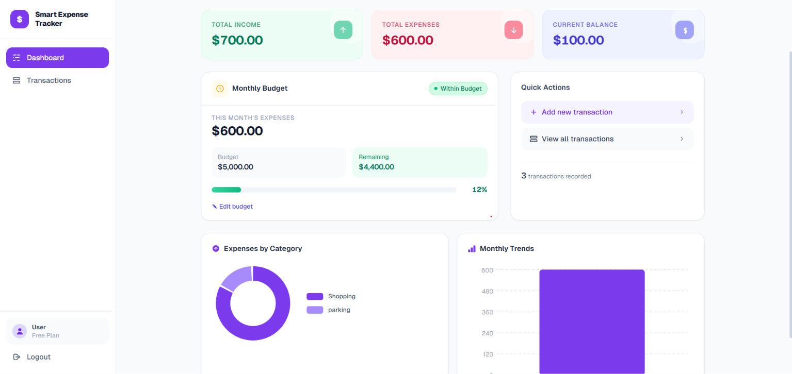
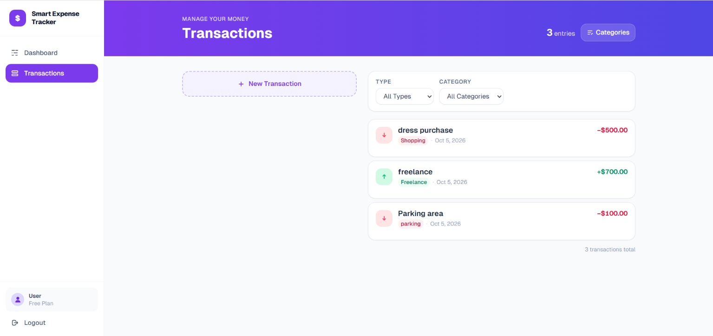
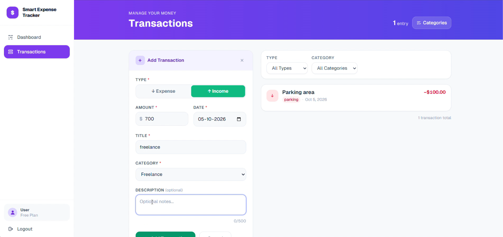
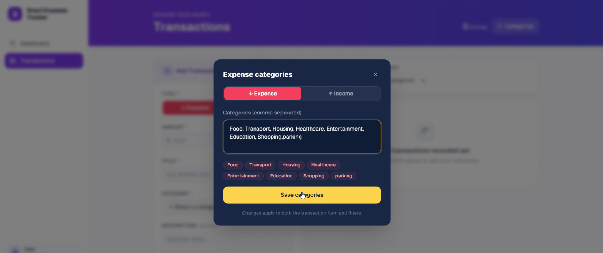

# Smart Expense Tracker

> A modern personal finance web app for tracking income, expenses, balance, and monthly budgets — built with Next.js 14, TypeScript, and Tailwind CSS. No backend, no sign-up, no setup required.

[](https://nextjs.org/)
[](https://www.typescriptlang.org/)
[](https://tailwindcss.com/)
[](https://vitest.dev/)
[](#testing)
[](LICENSE)

---

## Table of Contents

- [Overview](#overview)
- [Screenshots](#screenshots)
- [Features](#features)
- [How It Works](#how-it-works)
- [Architecture](#architecture)
- [Technologies](#technologies)
- [Getting Started](#getting-started)
- [Testing](#testing)
- [Property-Based Testing](#property-based-testing)
- [Kiro Workflow](#kiro-workflow)
- [Demo Flow](#demo-flow)
- [localStorage Keys](#localstorage-keys)
- [Project Structure Notes](#project-structure-notes)
- [Contributing](#contributing)
- [License](#license)

---

## Overview

Smart Expense Tracker is a fully client-side personal finance application. Every dollar you earn or spend gets recorded, categorised, and reflected instantly across your dashboard — total income, total expenses, current balance, and monthly budget progress all update in real time.

There is no server, no database, and no account to create. All data lives in your browser's `localStorage` and stays private to your device.

The project was built as a Kiro University showcase, demonstrating spec-driven development, property-based testing, AI steering documents, automation hooks, and custom agents — all within a single Next.js application.

---

## Screenshots

### Dashboard


*Real-time summary cards showing Total Income ($700), Total Expenses ($600), and Current Balance ($100). Budget progress bar, Expenses by Category donut chart, and Monthly Trends bar chart.*

### Transaction List


*All transactions listed newest-first with type indicator, category badge, date, and amount. Filter dropdowns for Type and Category at the top.*

### Add Transaction Form


*Slide-in form for adding a new transaction. Supports Expense and Income types, custom amount, date, title, category, and optional description.*

### Category Manager


*Category Manager modal for adding and managing custom expense and income categories. Changes apply instantly to the transaction form and filter dropdowns.*

---

## Features

### 💰 Total Income
Shows the total amount of money received or added as income across all recorded transactions. Updates instantly whenever a new income transaction is added or edited.

### 💸 Total Expenses
Shows the total amount spent across all recorded expense transactions. Aggregates every expense entry regardless of category or date.

### 📈 Current Balance
Shows the remaining balance by calculating total income minus total expenses, updated in real time. Displays negative balances in red with the Unicode minus sign.

### 🎯 Monthly Budget
Shows the spending limit set by the user for the current month, with a visual progress bar that shifts green → amber → red as spending increases. Supports three states: `WITHIN_BUDGET`, `APPROACHING_BUDGET`, and `OVER_BUDGET`.

### 📅 This Month's Expenses
Shows how much the user has spent during the current month, helping them track their spending against their budget. Only counts expense transactions whose date falls within the current calendar month.

### 📝 Transaction Management
Users can add, edit, delete, filter, and sort their transactions. Includes:
- Validated form with type, category, amount, description, and date fields
- Filter by type (Income / Expense) and category
- Sort by date (newest first)
- Delete confirmation dialog to prevent accidental removal
- Stale-update protection (optimistic concurrency) that prevents silent overwrites
- Full persistence via `localStorage` — data survives page refreshes and browser restarts

### 🏷️ Category Management
Users can add their own custom categories and delete categories they no longer need, giving them full flexibility to organise their transactions beyond the built-in defaults.

### 🔒 Privacy First
No account, no server, no tracking. All data is stored exclusively in the user's own browser via `localStorage`. Clearing browser data removes all records — nothing is sent anywhere.

### ⚡ Instant Updates
Every change — adding a transaction, editing an amount, deleting a record, or updating the budget — immediately recalculates and re-renders all summary cards and the budget progress bar without any page reload.

---

## How It Works

```
User Action → Component → lib/manager → lib/store (localStorage) → Component re-renders
```

1. The user interacts with a React component (e.g., submits `TransactionForm`).
2. The component calls a pure function in `lib/*/manager.ts` (e.g., `addTransaction`).
3. The manager validates the input, applies the business logic, and returns the updated state.
4. The component calls `lib/*/store.ts` to persist the new state to `localStorage`.
5. React state updates trigger a re-render, and all dependent components (summary cards, budget bar) reflect the new data instantly.

All business logic lives in pure TypeScript functions with zero React dependencies — making them fully testable without a DOM.

---

## Architecture

```
smart-expense-tracker/
├── app/
│   ├── layout.tsx                   # Root layout with sticky navbar
│   ├── page.tsx                     # Landing page
│   └── (app)/
│       ├── layout.tsx               # App shell layout
│       ├── dashboard/
│       │   └── page.tsx             # Dashboard page
│       └── transactions/
│           └── page.tsx             # Transactions CRUD page
├── components/
│   ├── auth/
│   │   ├── AuthModal.tsx            # Login / register modal
│   │   └── AuthButtons.tsx          # Sign in / out buttons
│   ├── dashboard/
│   │   ├── SummaryCard.tsx          # Individual metric card
│   │   ├── BalanceSummary.tsx       # Grid of 3 summary cards
│   │   ├── MonthlyBreakdown.tsx     # Monthly expense breakdown
│   │   └── EmptyState.tsx           # CTA when no transactions exist
│   ├── transactions/
│   │   ├── TransactionForm.tsx      # Add/edit form with validation
│   │   ├── TransactionList.tsx      # List with empty states
│   │   ├── TransactionItem.tsx      # Individual transaction row
│   │   ├── TransactionFilter.tsx    # Type + category filter dropdowns
│   │   └── DeleteConfirmDialog.tsx  # Confirmation modal
│   ├── budget/
│   │   ├── BudgetWidget.tsx         # Complete budget status display
│   │   ├── BudgetForm.tsx           # Budget input form
│   │   └── BudgetProgressBar.tsx    # Visual progress indicator
│   ├── settings/
│   │   └── CategoryManager.tsx      # Add/delete custom categories
│   └── layout/
│       └── Sidebar.tsx              # App navigation sidebar
├── lib/
│   ├── transactions/
│   │   ├── types.ts                 # Shared TypeScript interfaces
│   │   ├── constants.ts             # Predefined category lists
│   │   ├── validator.ts             # Pure validation functions
│   │   ├── manager.ts               # Pure CRUD and filter functions
│   │   └── store.ts                 # localStorage persistence
│   ├── dashboard/
│   │   └── calculator.ts            # calculateSummary (pure)
│   ├── budget/
│   │   ├── manager.ts               # evaluateBudget, computeMonthlyExpenses
│   │   └── store.ts                 # localStorage persistence for budget
│   ├── categories/
│   │   └── store.ts                 # localStorage persistence for categories
│   └── utils/
│       └── currency.ts              # formatCurrency utility
├── __tests__/
│   ├── arbitraries.ts               # Shared fast-check generators
│   ├── transactions/                # 8 PBTs + unit + store tests
│   ├── dashboard/                   # 7 PBTs + unit + component tests
│   ├── budget/                      # 7 PBTs + unit + store tests
│   ├── components/                  # Component tests (5 files)
│   └── utils/                       # Currency utility tests
└── .kiro/
    ├── specs/                       # Feature specs (requirements, design, tasks)
    ├── steering/                    # Persistent coding conventions
    ├── hooks/                       # Automation hooks
    ├── powers/                      # Custom Kiro powers
    └── agents/                      # Custom agent definitions
```

### Dependency Direction

```
app/* → components/* → lib/*
              ↑
        __tests__/*
```

`lib/` is pure TypeScript — no React, no JSX. Nothing in `lib/` imports from `components/` or `app/`.

---

## Technologies

| Layer | Technology | Purpose |
|---|---|---|
| Framework | Next.js 14 (App Router) | Routing, SSR, file-based pages |
| Language | TypeScript 5 | Type safety across all layers |
| Styling | Tailwind CSS 3 | Utility-first responsive design |
| Testing | Vitest 1 + @testing-library/react | Unit, component, and integration tests |
| Property testing | fast-check 4 | Mathematical invariant verification |
| Persistence | Browser `localStorage` | Zero-backend data storage |
| Runtime | Node.js | Dev server and build tooling |
| Fonts | Geist (Vercel) | Clean sans-serif and mono typography |

---

## Getting Started

### Prerequisites

- Node.js 18 or later
- npm 9 or later

### Install dependencies

```bash
npm install
```

### Run the development server

```bash
npm run dev
```

Open [http://localhost:3000](http://localhost:3000) in your browser.

### Build for production

```bash
npm run build
npm start
```

### Lint

```bash
npm run lint
```

---

## Testing

### Run all tests

```bash
npm run test
```

Runs all 240 tests (unit, component, and property-based) once and exits.

### Watch mode

```bash
npm run test:watch
```

### Coverage report

```bash
npm run test:coverage
```

### TypeScript validation (no emit)

```bash
npx tsc --noEmit
```

### Test counts by category

| Suite | Files | Tests |
|---|---|---|
| `__tests__/transactions/` | validator, manager, store, PBT | ~80 |
| `__tests__/dashboard/` | calculator, SummaryCard, PBT | ~50 |
| `__tests__/budget/` | manager, store, PBT | ~60 |
| `__tests__/components/` | 5 component files | ~40 |
| `__tests__/utils/` | currency | ~10 |
| **Total** | | **240** |

---

## Property-Based Testing

Property-based testing (PBT) automatically generates hundreds of random inputs and checks that mathematical invariants hold across all of them — not just the examples a developer thought to write.

This project uses [fast-check](https://fast-check.dev/) for PBT. There are 22 properties spread across three suites:

### `__tests__/transactions/manager.pbt.ts` — 8 properties

1. Balance invariant: `balance === totalIncome - totalExpenses` for any transaction list
2. Amount non-negative: `validateTransaction` always passes for generated valid inputs
3. Filter subset: `getTransactions` never introduces transactions not in the store
4. Add increases total expenses: adding an EXPENSE increases the sum by exactly that amount
5. Delete decreases count: deleting an existing transaction reduces store length by exactly 1
6. Sort stability: results are always sorted by date desc, then `createdAt` desc
7. Round-trip persistence: `saveTransactions` → `loadTransactions` returns the same list
8. Edit preserves ID: `updateTransaction` never changes a transaction's `id`

### `__tests__/dashboard/calculator.pbt.ts` — 7 properties

1. `balance === totalIncome - totalExpenses` within floating-point tolerance
2. `totalIncome >= 0` for any list
3. `totalExpenses >= 0` for any list
4. Adding one INCOME of amount `a` → `newBalance === oldBalance + a`
5. Adding one EXPENSE of amount `a` → `newBalance === oldBalance - a`
6. Shuffling the list does not change income, expenses, or balance
7. `calculateSummary([])` always returns all zeros

### `__tests__/budget/manager.pbt.ts` — 7 properties

1. `monthlyExpenses >= 0` for any list and any month
2. `status === WITHIN_BUDGET` iff `monthlyExpenses <= budget`
3. `remaining` is non-negative when status is `WITHIN_BUDGET`
4. `overspend` is non-negative when status is `OVER_BUDGET`
5. `percentage >= 0` and the visual fill `Math.min(percentage, 100) <= 100`
6. Adding an EXPENSE in a month increases that month's total by exactly that amount
7. Transactions with dates outside the target month contribute nothing to monthly expenses

### Running PBT tests only

```bash
npm run test -- --reporter=verbose manager.pbt
```

Each property runs 100 generated cases. When a property fails, fast-check shrinks the input to the smallest counterexample and prints it.

---

## Kiro Workflow

This project was built using Kiro's spec-driven, AI-assisted workflow. The `.kiro/` directory contains all the artefacts from that process.

### Kiro University — 7 Lesson Mapping

| Lesson | Implementation | Evidence |
|---|---|---|
| **1. Spec-driven development** | All three features were designed as Kiro specs before implementation: requirements → design → tasks | `.kiro/specs/transaction-management/`, `.kiro/specs/dashboard-balance/`, `.kiro/specs/monthly-budget/` — each with `requirements.md`, `design.md`, `tasks.md` |
| **2. Steering documents** | Four always-loaded steering docs define coding conventions, architecture rules, testing patterns, and UI guidelines that Kiro follows in every session | `.kiro/steering/project-architecture.md`, `coding-conventions.md`, `testing-conventions.md`, `ui-conventions.md` |
| **3. Hooks** | Two file-watch hooks automate quality gates on every save | `.kiro/hooks/run-tests-on-lib-change.kiro.hook` — runs `npm run test` on changes to `lib/` or `__tests__/`; `typecheck-on-change.kiro.hook` — runs `npx tsc --noEmit` on changes to `lib/`, `components/`, or `app/` |
| **4. Property-based testing** | 22 fast-check properties across three PBT suites verify mathematical invariants of the core business logic | `__tests__/transactions/manager.pbt.ts` (8), `__tests__/dashboard/calculator.pbt.ts` (7), `__tests__/budget/manager.pbt.ts` (7) |
| **5. Powers** | A custom `expense-validator` power bundles three steering guides for working with PBT in this project | `.kiro/powers/expense-validator/POWER.md` + steering guides: `running-pbt-tests.md`, `writing-new-properties.md`, `regression-from-counterexample.md` |
| **6. MCP** | A credential-free local filesystem MCP server gives Kiro structured read/write access to the project directory during code review and development sessions | `.kiro/settings.json` configures `@modelcontextprotocol/server-filesystem` scoped to the project root |
| **7. Custom agents** | An Expense Review Agent audits transaction data against all 6 validation rules, detects 8 suspicious patterns, and evaluates budget impact — read-only by default | `.kiro/agents/expense-review-agent.md` |

---

## Demo Flow

Follow these steps to explore all features end to end.

1. **Start the app** — run `npm run dev` and open [http://localhost:3000](http://localhost:3000)
2. **Landing page** — explore the hero section with feature highlights and quick-action links
3. **Empty state** — navigate to the dashboard; it shows an empty state CTA because no transactions exist yet
4. **Add income** — go to Transactions → click "Add Transaction" → set type to Income, category Salary, enter an amount and date → save
5. **Add expenses** — add two or three Expense transactions (e.g., Food, Transport) with different amounts and dates
6. **Check the dashboard** — return to the dashboard; the three summary cards now show total income, total expenses, and current balance
7. **Set a budget** — in the Budget widget, set a monthly spending limit (e.g., $5,000)
8. **Watch the progress bar** — add more expense transactions for the current month; the bar moves green → amber → red as you approach or exceed the limit
9. **Filter transactions** — on the Transactions page, use the Type and Category dropdowns to filter the list
10. **Edit a transaction** — click the edit icon on any row, change the amount, and save; the dashboard updates instantly
11. **Add a custom category** — use the Category Manager to add a category like "Side Project Income" or "Gym"
12. **Delete a transaction** — click the delete icon, confirm in the dialog; all summaries and the budget bar update immediately
13. **Reload the page** — all data persists because it is stored in `localStorage`

---

## localStorage Keys

| Key | Purpose | Format |
|---|---|---|
| `smart-expense-tracker-transactions` | All transactions | JSON array of `Transaction` objects |
| `smart-expense-tracker-budget` | Monthly budget amount | Numeric string (e.g., `"5000"`) |
| `smart-expense-tracker-categories` | Custom user categories | JSON array of category name strings |

---

## Project Structure Notes

- `lib/` is pure TypeScript — no React, no JSX, no browser globals except `localStorage` in `*.store.ts` files
- All components use `'use client'` and load/save exclusively through `lib/*/store.ts`
- `__tests__/` mirrors the `lib/` structure; test files live alongside their logical counterpart, not inside `lib/`
- Currency amounts are always displayed in USD with exactly 2 decimal places (`$1,234.56`); negative balances use the Unicode minus sign (`−$123.45`), not an ASCII hyphen
- The app is fully responsive — layout adapts from mobile (single-column) to desktop (sidebar + main content)
- All interactive elements include keyboard navigation and ARIA attributes for accessibility

---

## Contributing

1. Fork the repository
2. Create a feature branch: `git checkout -b feature/my-feature`
3. Make your changes following the coding conventions in `.kiro/steering/`
4. Run tests: `npm run test`
5. Run type check: `npx tsc --noEmit`
6. Commit your changes: `git commit -m 'feat: add my feature'`
7. Push to the branch: `git push origin feature/my-feature`
8. Open a pull request

---

## License

This project is licensed under the MIT License. See the [LICENSE](LICENSE) file for details.

---

> Built with ❤️ using [Kiro](https://kiro.dev) — the AI-powered development environment.
